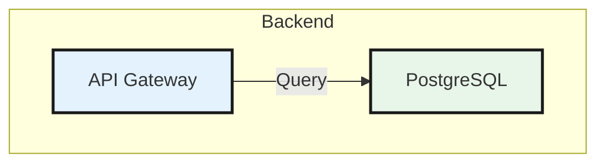

# panel-diagram


A Claude Code skill for creating professional technical diagrams as interactive standalone HTML files. Powered by **[Mermaid.js](https://mermaid.js.org)** — supports 11 diagram types including flowcharts, sequence diagrams, ER diagrams, class diagrams, git graphs, mind maps, and more. Dark mode, step-through reveal, and export (PNG/SVG/PDF) built in.

---

## 🚀 Key Features

- **Infographic Aesthetic:** High-contrast 2.5px strokes, 4px hard shadows, and Inter typography.
- **Interactive Step-Through:** Support for narrative flows where users click to reveal architecture phases (Phase 1 → Phase 2 → Complete).
- **Dynamic Theme Engine:** Full support for Dark and Light modes with smooth CSS transitions.
- **Annotated "Deep Dives":** Built-in styling for technical "Notes" to explain complex logic.
- **Zero-Build Portability:** Outputs a single self-contained `.html` file that renders anywhere.

---

## Usage

Invoke with `/panel-diagram` in Claude Code, then describe your technical requirement:

```text
/panel-diagram — how OAuth 2.0 works
/panel-diagram — interactive walkthrough of a RAG pipeline
/panel-diagram — Transformer architecture "Attention Is All You Need"
```

---

## 🖼️ Featured Examples

Explore these high-fidelity diagrams in the `examples/` directory:

**Architecture & Flow**
- **[Transformer Architecture](examples/transformer-deep-dive.html):** Complete visual breakdown of "Attention Is All You Need" with interactive step-through and dark mode.
- **[OAuth 2.0 Flow](examples/oauth-flow.html):** Sequence diagram of the Authorization Code grant type.
- **[API Gateway](examples/architecture-api-gateway.html):** System design overview of a modern cloud edge architecture.
- **[CI/CD Pipeline](examples/pipeline-cicd.html):** Git push → build → test → deploy pipeline stages.
- **[E-commerce Order Flow](examples/ecommerce-order-flow.html):** Order fulfillment from checkout to delivery notification.

**Object & Data Models**
- **[E-Commerce Domain Model](examples/class-diagram.html):** UML class diagram with User, Order, Product, Payment entities.
- **[Blog Database Schema](examples/er-diagram.html):** ER diagram with tables, PK/FK/UK annotations, and relationships.
- **[Order Lifecycle](examples/state-machine.html):** State machine covering all order states from Pending to Refunded.

**Planning & Discovery**
- **[Feature Priority Matrix](examples/quadrant-chart.html):** Quadrant chart of Q3 features by effort vs impact.
- **[API Traffic Distribution](examples/pie-chart.html):** Pie chart of request volume across 8 microservices.

**Knowledge & History**
- **[Evolution of the Web](examples/timeline.html):** Timeline from Web 1.0 (1991) to the AI era (2024).
- **[System Design Topics](examples/mindmap.html):** Mind map covering scalability, storage, caching, reliability, and more.
- **[GitFlow Strategy](examples/git-graph.html):** Git graph showing feature branches, releases, hotfixes, and tags.

---

## Design System

The skill uses a calibrated design system to ensure all diagrams look "published":

- **Panels (Subgraphs):** Rounded rectangles (`rx: 16px`) with neutral background tints.
- **Nodes:** Thick outlines (`#1A1A1A`) and semi-bold Inter text.
- **Notes:** Yellow-tinted callouts (`#FFF9C4`) for technical explanations.
- **Typography:** Uses **Inter** for UI and **JetBrains Mono** for math/code.

### Calibrated Color Palette

| Class | Color (Light) | Color (Dark) | Logical Role |
| :--- | :--- | :--- | :--- |
| `yellow` | `#FFFDE7` | `#2A2310` | Users, Entry Points, Browsers |
| `blue` | `#E3F2FD` | `#0A1929` | Services, APIs, Processing |
| `green` | `#E8F5E9` | `#0A1F0A` | Databases, Storage, Success |
| `purple` | `#F3E5F5` | `#1A0A2A` | Auth, AI Models, Security |
| `orange` | `#FFF3E0` | `#2A1A08` | Queues, Events, Pipelines |
| `teal` | `#E0F7FA` | `#002A2A` | Caching, External Edge APIs |

---

## "Ultra" Mode Features

When generating complex diagrams, the skill can include an interaction layer:

### 1. Sequential Discovery (Step-Through)
The diagram builds itself as the user clicks, revealing logical phases one-by-one. This is ideal for teaching complex architectures like **Transformers** or **OAuth 2.0**.

### 2. Adaptive Theme Toggle
The UI includes a professional theme toggle (🌙 Dark / ☀️ Light) that dynamically updates the entire SVG and UI without a page reload.

### 3. Status Pill
A floating, pulsing pill at the bottom-right guides the user through the interactive steps.

---

## Diagram Type Reference

Pick the right Mermaid keyword for the job:

| Intent | Mermaid keyword |
|---|---|
| Flow, pipeline, architecture, system overview | `graph TD` / `graph LR` |
| Sequence, API calls, actor interactions | `sequenceDiagram` |
| Class / object / domain model (UML) | `classDiagram` |
| State machine, lifecycle, status transitions | `stateDiagram-v2` |
| Database schema, tables, entity relationships | `erDiagram` |
| 2×2 priority / effort-impact matrix | `quadrantChart` |
| History, milestones, roadmap dates | `timeline` |
| Brainstorm, concept map, topic overview | `mindmap` |
| Git branching, commits, merges | `gitGraph` |
| Distribution, percentage breakdown | `pie` |
| Project schedule, sprint plan | `gantt` |

---

## Example Mermaid Logic



---

## Export Formats

`capture.js` supports high-quality exports for documentation and design tools:

```bash
# Animated GIF (captures the reveal sequence)
node capture.js diagram.html --fps=12 --duration=5

# High-Res PNG (perfect for blog posts)
node capture.js diagram.html --format=png --scale=2

# Vector SVG (for Figma/Sketch)
node capture.js diagram.html --format=svg
```
