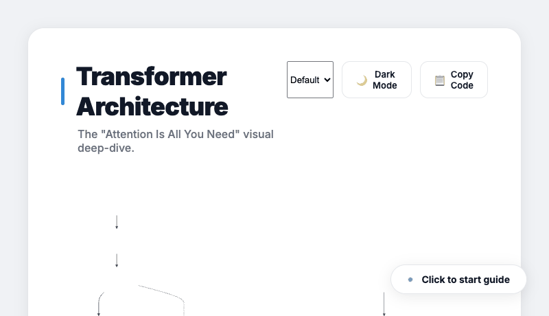

# visualcave


[](LICENSE)

An agentic skill for creating professional technical diagrams as interactive standalone HTML files. Powered by **[Mermaid.js](https://mermaid.js.org)** — supports 11 diagram types including flowcharts, sequence diagrams, ER diagrams, class diagrams, git graphs, mind maps, and more. Dark mode, step-through reveal, and export (PNG/SVG/PDF) built in.

Works with **Claude Code**, **Cursor**, **Codex CLI**, and **Gemini CLI**.

**[View showcase →](https://varkart.github.io/visualcave)**



---

## Installation

**Claude Code (global)**
```bash
git clone https://github.com/varkart/visualcave ~/.claude/skills/visualcave
```

**Claude Code (per-project)**
```bash
git clone https://github.com/varkart/visualcave .claude/skills/visualcave
```

**Cursor** — copy `.cursor/rules/visualcave.mdc` into your project's `.cursor/rules/` directory.

**Codex CLI** — install via `.codex-plugin/plugin.json` or clone and reference the skill directory.

**Gemini CLI** — clone the repo; Gemini CLI will pick up `gemini-extension.json` automatically and load `SKILL.md` as context.

**Kiro** — copy `.kiro/rules/visualcave.md` into your project's `.kiro/rules/` directory. (See [issue #7](https://github.com/varkart/visualcave/issues/7) — in progress)

No restart required after installation.

---

## Usage

See **[EXAMPLES.md](EXAMPLES.md)** for real prompts and patterns showing what to ask for and what output to expect.

Invoke with `/visualcave` in your AI assistant, then describe your diagram:

```text
/visualcave — how OAuth 2.0 works
/visualcave — interactive walkthrough of a RAG pipeline
/visualcave — Transformer architecture "Attention Is All You Need"
/visualcave — order lifecycle state machine with all edge cases
/visualcave — GitFlow branching strategy with release and hotfix branches
```

Outputs a single self-contained `.html` file. Open it in any browser — no build step, no server.

---

## Key Features

- **11 diagram types** — flowchart, sequence, class, ER, state machine, quadrant, timeline, mind map, git graph, pie, gantt
- **Interactive step-through** — click to reveal phases one by one (ideal for architecture walkthroughs)
- **Design theme selector** — Default, Minimal, Pastel, Print; switches classDef colors + Mermaid theme on the fly, persisted to `localStorage`
- **Dark / light mode toggle** — smooth CSS transition, respects `prefers-color-scheme`
- **Copy Mermaid source** — one-click copy of the clean diagram source
- **Export** — PNG, SVG, PDF, animated GIF, OG social card via `capture.js`
- **Zero dependencies at runtime** — Mermaid loaded from CDN, everything else inline

---

## Diagram Type Reference

| Intent | Mermaid keyword |
|---|---|
| Flow, pipeline, architecture, system overview | `graph TD` / `graph LR` |
| Sequence, API calls, actor interactions | `sequenceDiagram` |
| Class / object / domain model (UML) | `classDiagram` |
| State machine, lifecycle, status transitions | `stateDiagram-v2` |
| Database schema, tables, entity relationships | `erDiagram` |
| 2×2 priority / effort-impact matrix | `quadrantChart` |
| History, milestones, roadmap dates | `timeline` |
| Brainstorm, concept map, topic overview | `mindmap` |
| Git branching, commits, merges | `gitGraph` |
| Distribution, percentage breakdown | `pie` |
| Project schedule, sprint plan | `gantt` |

---

## Examples

All 13 examples are in [`examples/`](examples/) and live at the [showcase site](https://varkart.github.io/visualcave).

**Architecture & Flow**
- [Transformer Architecture](examples/transformer-deep-dive.html) — step-through, dark mode
- [OAuth 2.0 Flow](examples/oauth-flow.html) — sequence diagram
- [API Gateway Architecture](examples/architecture-api-gateway.html)
- [CI/CD Pipeline](examples/pipeline-cicd.html)
- [E-commerce Order Flow](examples/ecommerce-order-flow.html)

**Object & Data Models**
- [E-Commerce Domain Model](examples/class-diagram.html) — `classDiagram`
- [Blog Database Schema](examples/er-diagram.html) — `erDiagram`
- [Order Lifecycle](examples/state-machine.html) — `stateDiagram-v2`

**Planning & Analysis**
- [Feature Priority Matrix](examples/quadrant-chart.html) — `quadrantChart`
- [API Traffic Distribution](examples/pie-chart.html) — `pie`

**Knowledge & History**
- [Evolution of the Web](examples/timeline.html) — `timeline`
- [System Design Topics](examples/mindmap.html) — `mindmap`
- [GitFlow Strategy](examples/git-graph.html) — `gitGraph`

---

## Color Palette

Apply these `classDef` classes in `graph` and `classDiagram` diagrams:

| Class | Use for |
|---|---|
| `:::yellow` | Users, browsers, entry points |
| `:::blue` | Services, APIs, compute |
| `:::green` | Databases, storage, success states |
| `:::purple` | Auth, AI models, security |
| `:::orange` | Queues, events, pipelines |
| `:::teal` | Caching, CDN, external APIs |
| `:::note` | Annotations, callouts |

---

## Export

```bash
node capture.js diagram.html                    # animated GIF
node capture.js diagram.html --format=png       # PNG screenshot
node capture.js diagram.html --format=svg       # extracted SVG
node capture.js diagram.html --format=pdf       # A4 PDF
node capture.js diagram.html --format=og        # 1200×630 OG image
```

---

## Development

Requires **Node.js 18+** (for `capture.js` / puppeteer).

```bash
npm install
npx playwright install chromium
npm test             # run all diagram validation tests
npm run test:ui      # Playwright UI mode
npm run test:headed  # headed browser
```

---

## Contributing

See [CLAUDE.md](CLAUDE.md) for contribution guidelines — what's accepted, what won't be merged, and how to run tests.

---

## License

MIT — see [LICENSE](LICENSE).
