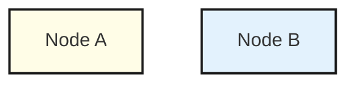

# Panel Diagram Skill (Infographic Style)

Single `.html`, inline Mermaid.js. No hardcoded SVG coordinates! This makes generation 10x faster. 

**Visual Style Rules:**
- Clean, rounded boxes with a slight 4px drop shadow.
- Thick strokes (2px) for borders and arrows.
- Warm/cool panel (subgraph) alternation (yellow, blue, green, purple, teal, orange).
- Inter typography (bold for titles, semi-bold for nodes).
- Use the right Mermaid keyword for the job — see **Diagram Type Reference** table at the bottom.

## Output Format

Output a complete, self-contained HTML file. No markdown code block wrapper unless requested.

**HTML Template:**

```html
<!DOCTYPE html>
<html lang="en">
<head>
  <meta charset="utf-8">
  <meta name="viewport" content="width=device-width, initial-scale=1">
  <link href="https://fonts.googleapis.com/css2?family=Inter:wght@400;500;600;700;800;900&family=JetBrains+Mono:wght@500&display=swap" rel="stylesheet">
  <style>
    :root {
      --bg: #F0F2F5;
      --card-bg: #FFFFFF;
      --text-main: #111827;
      --text-muted: #6B7280;
      --border: #E5E7EB;
      --accent: #1E88E5;
      --shadow: 0 4px 20px rgba(0,0,0,0.08);
      --node-stroke: #1A1A1A;
    }
    [data-theme="dark"] {
      --bg: #0F1117;
      --card-bg: #1A1D27;
      --text-main: #F9FAFB;
      --text-muted: #9CA3AF;
      --border: #2A2D3A;
      --accent: #3B82F6;
      --shadow: 0 4px 24px rgba(0,0,0,0.4);
      --node-stroke: #3A3D50;
    }
    body { background: var(--bg); color: var(--text-main); display: flex; justify-content: center; padding: 40px; font-family: 'Inter', sans-serif; margin: 0; transition: background 0.3s ease; }
    .page { background: var(--card-bg); border-radius: 24px; padding: 48px; box-shadow: var(--shadow); width: 100%; max-width: 1200px; position: relative; border: 1px solid var(--border); transition: background 0.3s ease, border 0.3s ease; }
    header { display: flex; justify-content: space-between; align-items: flex-start; margin-bottom: 40px; }
    .title-group h1 { margin: 0; font-size: 36px; font-weight: 900; letter-spacing: -0.02em; display: flex; align-items: center; gap: 16px; }
    .title-group h1::before { content: ''; display: block; width: 8px; height: 40px; background: var(--accent); border-radius: 4px; }
    .title-group p { margin: 8px 0 0 24px; color: var(--text-muted); font-size: 16px; font-weight: 500; }
    .controls { display: flex; gap: 12px; }
    button { font: 600 13px 'Inter', sans-serif; padding: 10px 20px; border-radius: 12px; cursor: pointer; transition: all 0.2s ease; display: flex; align-items: center; gap: 8px; }
    .btn-secondary { background: var(--card-bg); border: 1px solid var(--border); color: var(--text-main); }
    .btn-secondary:hover { background: var(--bg); border-color: var(--accent); }

    /* Infographic Style Overrides */
    .mermaid svg { max-width: 100%; height: auto; }
    .node rect, .node circle, .node polygon, .node path {
      stroke-width: 2.5px !important;
      stroke: var(--node-stroke) !important;
      rx: 10px !important; ry: 10px !important;
      filter: drop-shadow(4px 4px 0px rgba(0,0,0,0.1));
    }
    .node text { font-weight: 500 !important; font-size: 14px !important; fill: var(--text-main) !important; }
    .edgePath .path { stroke-width: 2.5px !important; stroke: var(--text-muted) !important; }
    .edgeLabel { background-color: var(--card-bg) !important; padding: 4px 8px; border-radius: 6px; font-size: 11px; font-weight: 600; border: 1.5px solid var(--border); color: var(--text-main) !important; }
    .cluster rect { stroke-width: 2.5px !important; stroke: var(--node-stroke) !important; rx: 16px !important; fill: var(--bg) !important; }
    .cluster text { font-weight: 600 !important; font-size: 16px !important; fill: var(--text-main) !important; }
    @media (prefers-reduced-motion: reduce) {
      *, *::before, *::after { animation-duration: 0.01ms !important; transition-duration: 0.01ms !important; }
    }
  </style>
</head>
<body>
  <div class="page">
    <header>
      <div class="title-group">
        <h1>[Diagram Title]</h1>
        <p>[Subtitle / description]</p>
      </div>
      <div class="controls">
        <button class="btn-secondary" onclick="toggleTheme()" id="theme-toggle">🌙 Dark Mode</button>
        <button class="btn-secondary" onclick="copyMermaid(this)">📋 Copy Code</button>
      </div>
    </header>
    <div class="mermaid" id="diagram-source">
      graph TD
        classDef yellow fill:#FFFDE7,stroke:#1A1A1A,stroke-width:2px;
        classDef blue fill:#E3F2FD,stroke:#1A1A1A,stroke-width:2px;
        classDef green fill:#E8F5E9,stroke:#1A1A1A,stroke-width:2px;
        classDef purple fill:#F3E5F5,stroke:#1A1A1A,stroke-width:2px;
        classDef teal fill:#E0F7FA,stroke:#1A1A1A,stroke-width:2px;
        classDef orange fill:#FFF3E0,stroke:#1A1A1A,stroke-width:2px;
        classDef note fill:#FFF9C4,stroke:#FBC02D,stroke-dasharray:4;

        %% DIAGRAM NODES GO HERE
        A[Entry Point]:::yellow
        B[Process]:::blue
        A --> B
    </div>
  </div>
  <script type="module">
    import mermaid from 'https://cdn.jsdelivr.net/npm/mermaid@10/dist/mermaid.esm.min.mjs';

    // Snapshot source before Mermaid replaces it
    const src = document.getElementById('diagram-source').textContent.trim();
    document.getElementById('diagram-source').dataset.source = src;

    const isDark = window.matchMedia('(prefers-color-scheme: dark)').matches;
    if (isDark) document.documentElement.setAttribute('data-theme', 'dark');

    document.fonts.ready.then(() => {
      mermaid.initialize({
        startOnLoad: true,
        theme: 'base',
        flowchart: { htmlLabels: true, useMaxWidth: true, padding: 100 },
        themeVariables: {
          fontFamily: 'Inter, sans-serif',
          primaryColor: '#FFFDE7',
          primaryBorderColor: '#1A1A1A',
          primaryTextColor: '#1A1A1A',
          lineColor: '#424242',
          clusterBkg: '#F8F9FA',
          clusterBorder: '#1A1A1A'
        }
      });
    });

    window.toggleTheme = () => {
      const next = document.documentElement.getAttribute('data-theme') === 'dark' ? 'light' : 'dark';
      document.documentElement.setAttribute('data-theme', next);
      document.getElementById('theme-toggle').textContent = next === 'dark' ? '☀️ Light Mode' : '🌙 Dark Mode';
    };

    window.copyMermaid = function(btn) {
      const source = document.getElementById('diagram-source').dataset.source || '';
      navigator.clipboard.writeText(source).then(() => {
        const orig = btn.textContent;
        btn.textContent = '✓ Copied';
        setTimeout(() => btn.textContent = orig, 2000);
      });
    };
  </script>
</body>
</html>
```

## Styling Specific Nodes

In Mermaid, use `classDef` to apply specific colors to nodes matching the infographic color palette:



Apply these colors logically (e.g., green for success/databases, blue for compute/services, yellow for user/entry).

## Interactive Variants

### Step-through (`step-through.js`)

Use for sequential reveal of diagram elements. After Mermaid renders, add `data-step="N"` to SVG `<g>` elements via post-processing JS (see `transformer-ultra.html` for the full `setupSteps()` pattern). Then include:

```html
<script src="step-through.js"></script>
```

The pill UI attaches automatically. Clicking it advances one step at a time.

**Important:** `step-through.js` requires `data-step` attributes set via JS after Mermaid renders — you cannot set them in Mermaid source. Copy the `setupSteps()` + `stepConfig` pattern from `transformer-ultra.html` and adapt the node ID lists.

### Hover highlight (`hover.js`)

Add `data-node="id"` to node `<g>` elements and `data-connects="id1,id2"` to edge `<g>` elements via post-render JS. Then include:

```html
<script src="hover.js"></script>
```

Hovering dims all unrelated nodes/edges.

## Export
Remind the user they can capture the diagram using the existing tool:
```
node capture.js file.html            # animated GIF
node capture.js file.html --format=png
node capture.js file.html --format=pdf
node capture.js file.html --format=svg
node capture.js file.html --format=og   # 1200×630 social card
```

## Diagram Type Reference

Pick the Mermaid keyword that matches the user's intent:

| User says... | Mermaid keyword | Example file |
|---|---|---|
| flow, pipeline, architecture, data flow, system overview | `graph TD` / `graph LR` | `examples/ecommerce-order-flow.html` |
| sequence, API call, interaction between services, who calls who | `sequenceDiagram` | `examples/oauth-flow.html` |
| class, object model, domain model, OOP, UML | `classDiagram` | `examples/class-diagram.html` |
| state, lifecycle, status transitions, FSM | `stateDiagram-v2` | `examples/state-machine.html` |
| database, schema, tables, ER, entity-relationship | `erDiagram` | `examples/er-diagram.html` |
| priority, 2x2 matrix, effort vs impact, scatter | `quadrantChart` | `examples/quadrant-chart.html` |
| timeline, history, milestones, evolution, roadmap dates | `timeline` | `examples/timeline.html` |
| mind map, brainstorm, concept map, topics | `mindmap` | `examples/mindmap.html` |
| git, branching, gitflow, commits, merge | `gitGraph` | `examples/git-graph.html` |
| pie chart, distribution, percentage breakdown, share | `pie` | `examples/pie-chart.html` |
| gantt, schedule, project plan, sprint | `gantt` | — |

### Notes on `classDef` support per type

`classDef` color classes (`:::yellow`, `:::blue`, etc.) work in: `graph`, `classDiagram`, `stateDiagram-v2`.

For types that don't support `classDef` (`erDiagram`, `sequenceDiagram`, `timeline`, `mindmap`, `gitGraph`, `pie`, `quadrantChart`), use `themeVariables` in `mermaid.initialize()` to control colors instead.